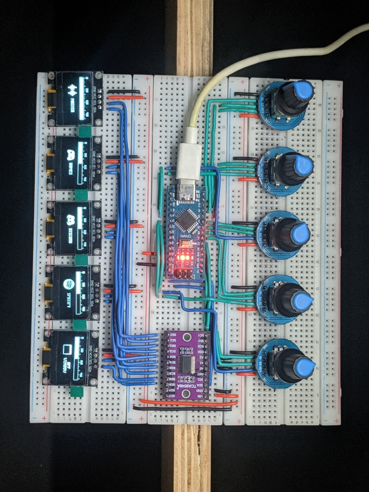
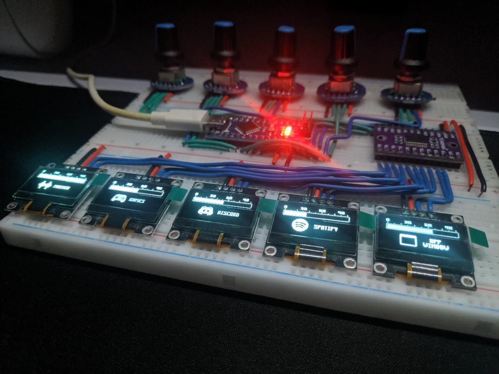
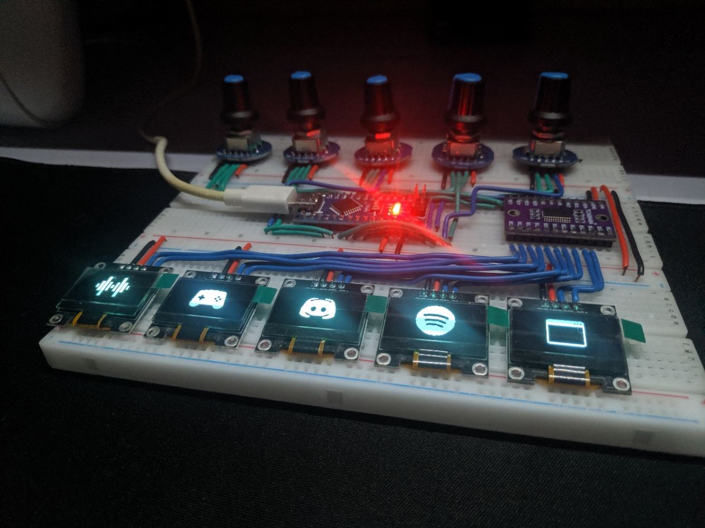
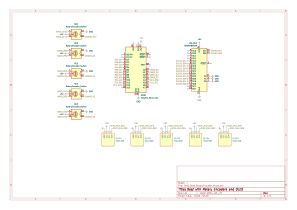

# deej

deej is an **open-source hardware volume mixer** for Windows and Linux PCs. It lets you use real-life sliders (like a DJ!) to **seamlessly control the volumes of different apps** (such as your music player, the game you're playing and your voice chat session) without having to stop what you're doing.

deej project: https://github.com/omriharel/deej/

**Join the [deej Discord server](https://discord.gg/nf88NJu) if you need help or have any questions!**

# deej with Rotary Encoders and OLEDs

- 5 Rotary Encoders with mute function
- 5 OLEDs for visual feedback
- Enters screensaver mode to show bitmaps assigned to each encoder after 10 seconds of inactivity
- Enters sleep mode after 3 mins of inactivity to conserve display power

### Prototype

# Schematic

# Enclosure

#### Coming Soon!

# Build Video

#### Coming Soon!

